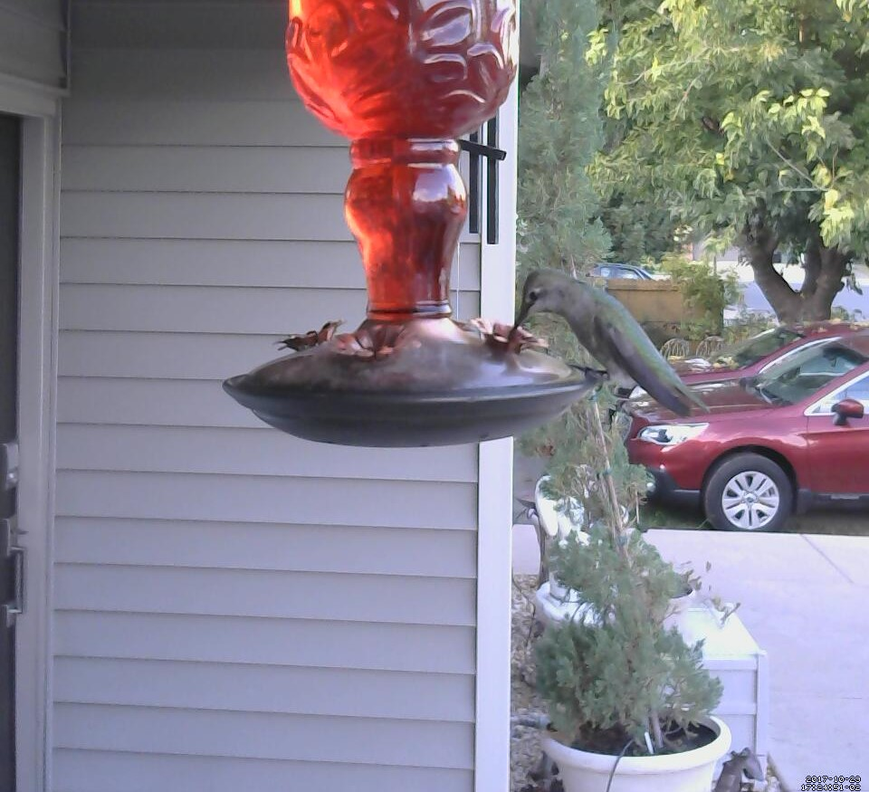

# Hummingbird_Watcher



These are the configuration files used with 
[motion](https://github.com/Motion-Project/motion) to capture usb webcam footage.

I'm currently using a 
[raspberry pi](http://amzn.to/2yBgiIi) 
with a [Logitech USB Webcam](http://amzn.to/2gNXKup).

### Setup and Configuration
First you need to install the motion software

```shell
$ sudo apt-get install motion
```

After the software installs you need to edit the configuration file.
 This is the [`motion.conf`](motion.conf) file
 
 ```shell
 $ sudo nano  /etc/motion/motion.conf
 ```
 
Using the configuration file in this repo pictures and video will be
 saved to /home/pi/themotion.
 
To start the server use the command below

```shell
$ sudo service motion start
```

A web server will start streaming on port 8081.

Use the command below to enable motion on system startup
 
 ```shell
 $ sudo systemctl enable motion
```

## Copyright and License
Copyright (c) 2017 Josh Sisto [MIT License](/LICENSE)
